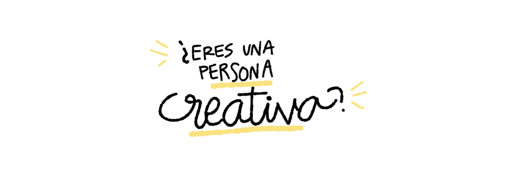
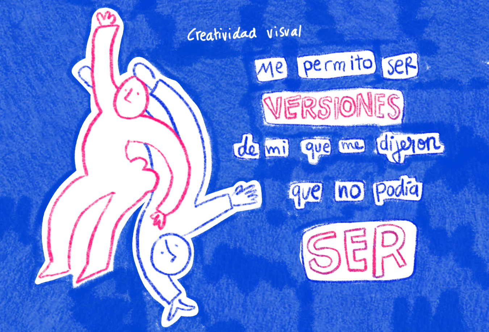
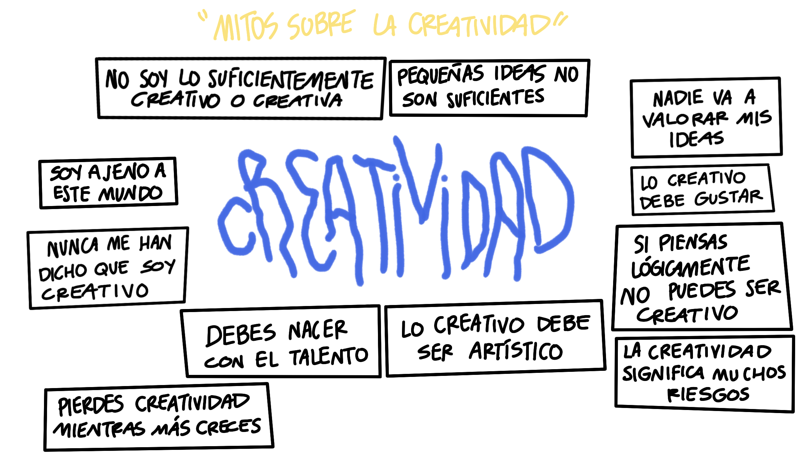
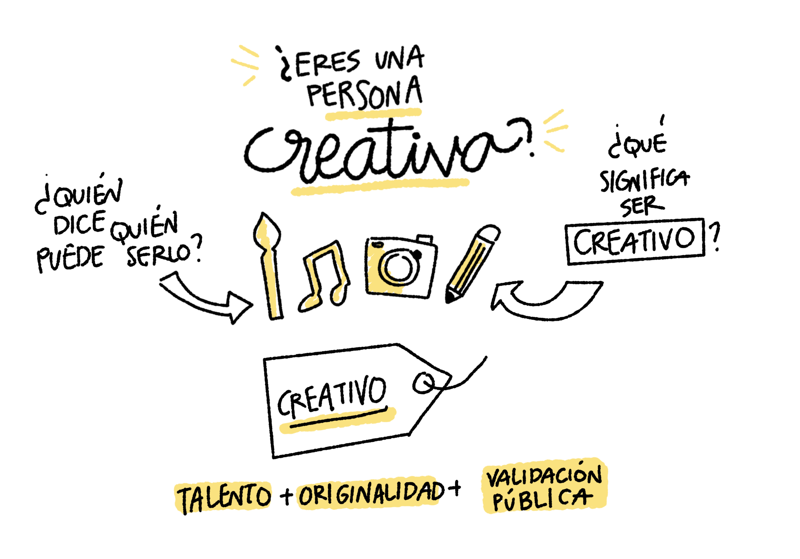
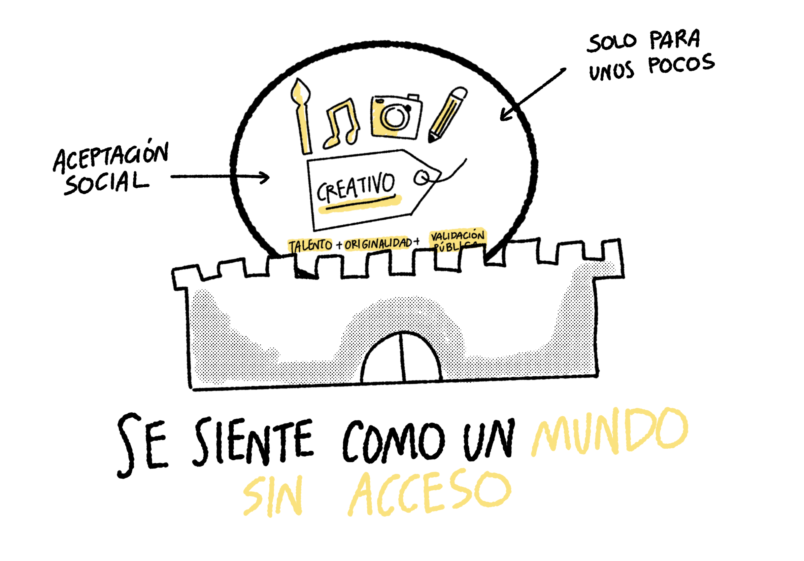
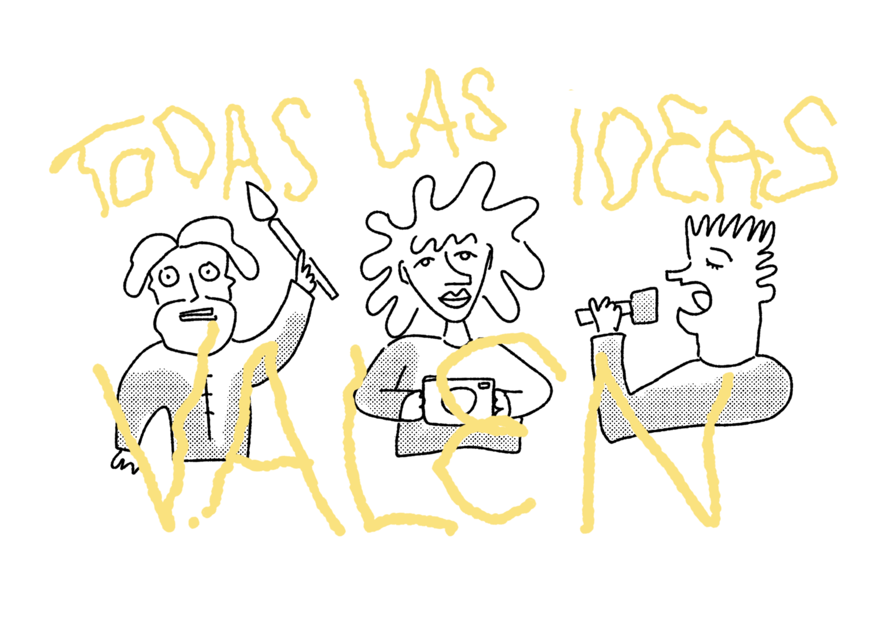
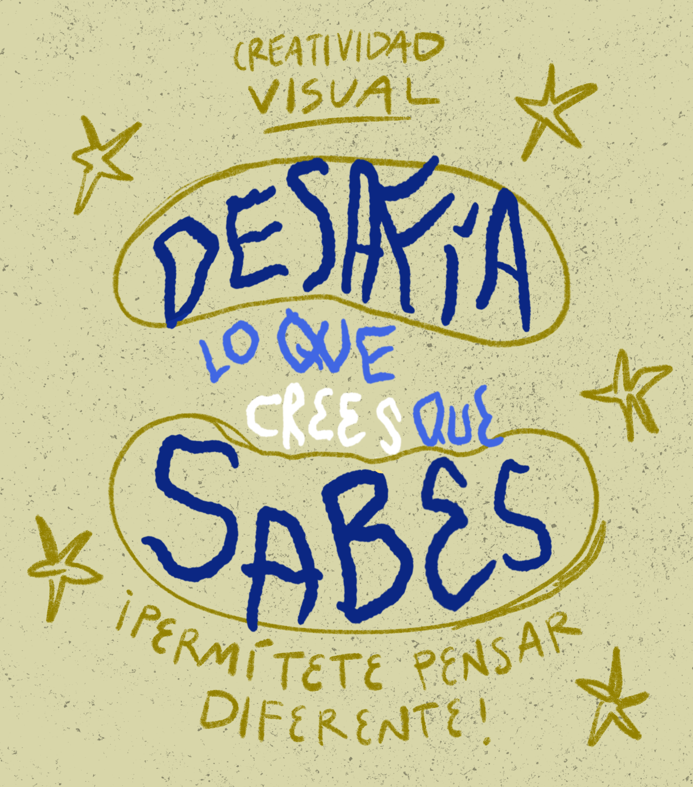

  I La mentira de “no soy creativo”

Para responder esta pregunta habría que preguntarse también **cuál es tu definición de ser una persona creativa.** Muchas veces creemos tener ciertas nociones sobre algunos conceptos que en automático damos por hecho, la creatividad es uno de ellos. Con el tiempo, con trabajo interno, y como instructor, me he dado cuenta que uno de los mayores bloqueos de las personas para aprender nuevas estrategias creativas es el hecho de percibirse como personas ajenas a este mundo. 

Es curioso por que tal vez el mayor bloqueo en estos procesos de aprendizaje tiene que ver con una **auto-descalificación**. A medida que he preguntado directamente y a medida que he presenciado los procesos de aprendizaje tanto personales como de mis alumnos, he entendido lo importante que es desafiar estas concepciones, resignificarlas y reacomodarlas en lugares más amables que nos permitan mirar las cosas desde otra perspectiva. 

<!-- Note begin -->

  ¿Quién te enseñó lo que significa ser creativo?

<!-- Note end -->

**¿Qué es ser alguien creativo?** Socialmente atribuímos que una persona creativa es alguien especial, talentosa, de gran reconocimiento, alguien que cumple con la ecuación de **talento + originalidad + validación pública**. Aceptamos en automático que para ser creativo hay que cumplir con normas desconocidas e inalcanzables, que además de ser original, necesitas gustarle a otras personas, aprendemos desde muy pequeños a complacer la mirada de los otros, y este factor se vuelve muy determinante en nuestro crecimiento y en nuestra toma de decisiones. 

Sin embargo la creatividad **tiene que ver con un asunto de generar ideas, de ver perspectivas diferentes, de encontrar caminos alternos**. Muchas veces a lo largo de mi vida he encontrado momentos en los que me he sentido como alguien que no encaja en las formas tradicionales, ese sentimiento de sentir que no perteneces puede ser muy duro, pero también puede ser más común de lo que aparenta. 

Por ejemplo, cuando regresaba a casa después de la escuela me gustaba mucho cambiar mi ruta porque el camino de siempre me aburría, así que no me importaba caminar más cuadras con el fin de conocer más caminos y nuevos lugares. Este es un ejemplo muy superficial, pero con esto quiero ilustrar lo que es **la creatividad** para mi _se trata de encontrar nuevas y diferentes formas de ver, algunas mejor o peor que otras, no importa, se trata de las ideas que se te ocurren y como las llevas a la práctica._

<!-- Note begin -->

  La creatividad es una capacidad de generar ideas y diferentes formas de ver.

<!-- Note end -->

Este espíritu creativo es común identificarlo en los bebés y niños, cuando somos pequeños empezamos a conocer el mundo sin un juicio de valor sobre si algo _esta bien o esta mal_, imaginamos, creamos y experimentamos, porque estamos conociendo por vez primera el mundo que habitamos. A medida que crecemos aprendemos las nociones del bien y del mal, y vamos dejando de lado nuestra esencia creativa en favor de desarrollar otras habilidades prácticas. 

Y así es como olvidamos nuestra creatividad, adoptamos nuevos conceptos y prejuicios, e incluso **perdermos la capacidad de identificar aquellos momentos donde nuestra creatividad se expresa libremente**. 

Este material es un acompañamiento y un desafío para ti, es una oportunidad para que cuestiones lo que sabes sobre ti, para que te brindes nuevas oportunidades de entenderte como alguien lleno de creatividad, y que puedas aprender formas diferentes de ver la vida.

<!-- Note begin -->

Esta es una gran oportunidad de cuestionar lo que piensas que es la creatividad y lo que te dijeron que era.

<!-- Note end -->

Desde cierto punto de vista me gusta ver que el **acto de crear es un acto de liberación**, de rebeldía, de cuestionar lo que nos enseñaron que debía ser la creatividad, de demostrar que nuestros pensamientos e ideas son válidos por el hecho de ser, que no hay juicio de valor que afecte nuestras capacidades y habilidades, que la creatividad es una habilidad humana propia y no sólo de artistas famosos. 

**Resignifiquemos la creatividad en nuestras vidas.**

