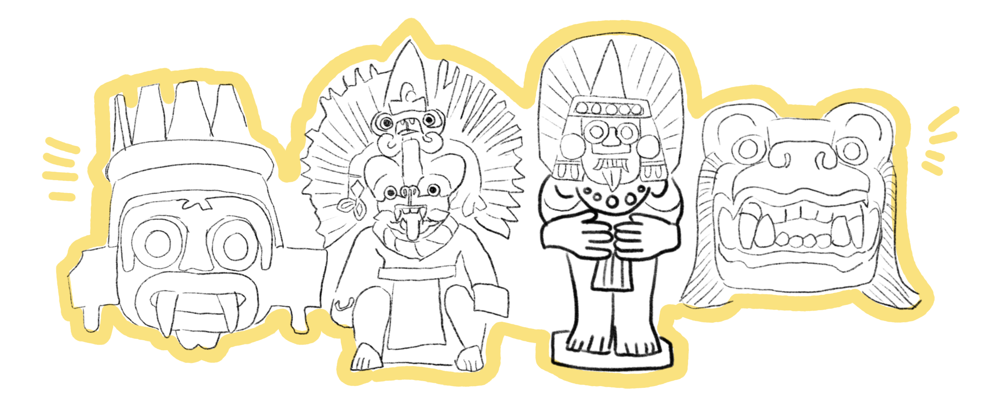
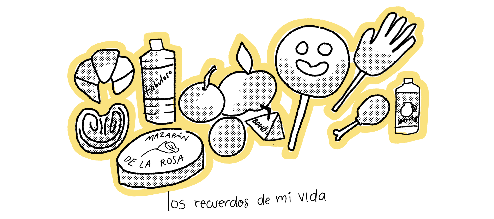
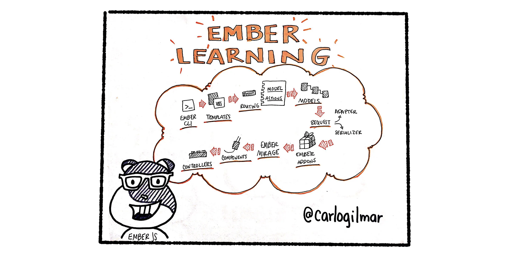
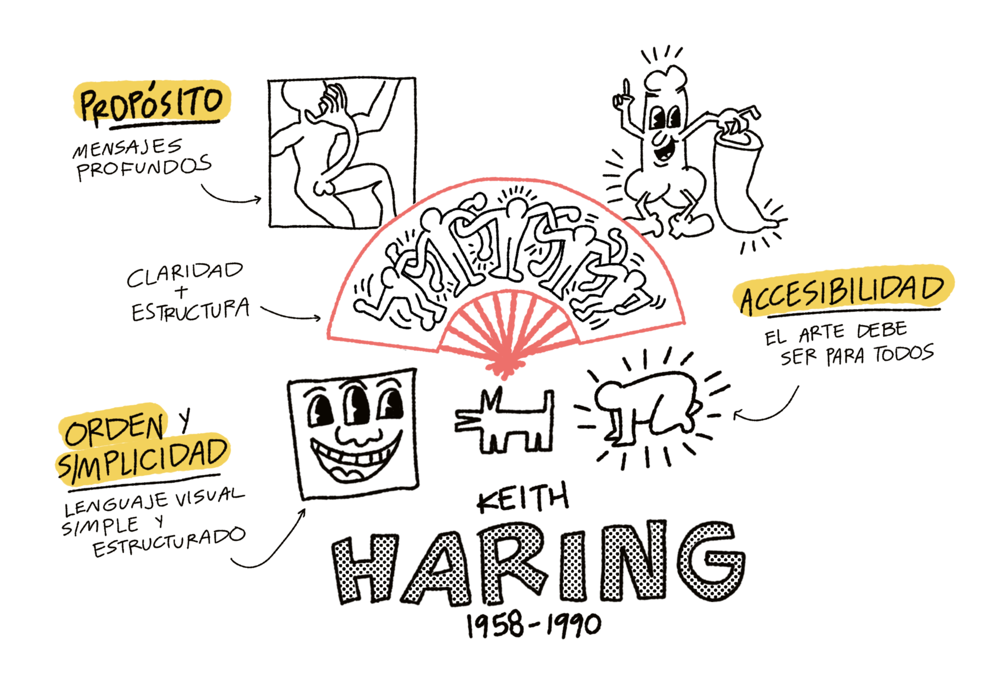
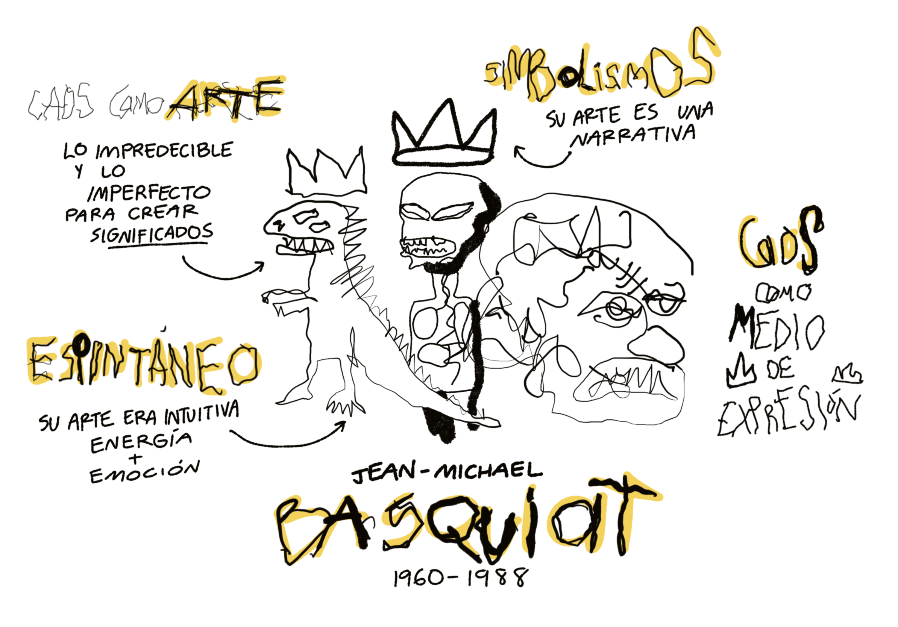

  II Tu creatividad visual

Más que hablar sobre una sola forma de ser creativos, podemos **hablar de un espectro o rango de diferentes formas de serlo**. Como he mencionado antes, uno de los bloqueos de mayor peso es la **autopercepción como personas no creativas**, y esto puede influir demasiado en tu proceso de aprendizaje, por eso mismo es importante comenzar por cuestionarnos nuestra definición de creatividad y al mismo tiempo dejar de lado los juicios de valor sobre nuestro trabajo. 

Los **seres humanos creamos por necesidad**, nuestras necesidades pueden ir desde necesidades fisiológicas como comer o respirar, hasta necesidades sociales y personales. La creatividad ha jugado un papel importante y determinante como condimento para resolver esas necesidades, lo podemos ver fácilmente en las pinturas rupestres o bien en las culturas prehispánicas. 

<!-- Note begin -->

  La creatividad visual nos permite codificar experiencias.

<!-- Note end -->

Comenzar a **percibir y apreciar los detalles** de lo que nos rodea es el paso inicial para desarrollar a conciencia nuestra creatividad, pocas veces nos ponemos a preguntar por qué conectamos mejor con ciertos colores, con ciertas formas, o con ciertos sonidos, muchos de nuestros gustos codifican incluso información genética de nuestros ancestros y por supuesto conectan con nuestra memoria emocional. Te invito a que durante este camino te des oportunidad de preguntarte e indagar por qué te gustan ciertas cosas, y tal vez encontrarás conexiones únicas con tu historia de vida, y si te fijas bien, esas mismas conexiones son únicas e irrepetibles, por más que alguien tenga experiencias similares, cada quién experimenta de forma única, y justo ahí es donde radica parte de tu originalidad. 

<!-- Note begin -->

  Nuestra historia de vida guarda nuestra originalidad.

<!-- Note end -->

Tal pareciera que **la creatividad es una forma muy humana de pensar y resolver problemas** pero también de cierta forma nos lleva a **codificar experiencias** y al mismo tiempo **crear significados**. Es un proceso de prueba y error sobre cómo interpretamos nuestra realidad, es un **proceso de experimentación y aproximación**. 

Aquí es donde la creatividad visual hace su presentación, parte de este espectro de variaciones de la creatividad, y como la **capacidad humana para transformas nuestra percepción de la realidad en significados visuales, ideas o soluciones.**

Rudolf Arnheim, psícologo berlinés que definió el término de _visual thinking_, hizo una crítica muy fuerte al decir que **vivimos en un mundo ahogado en el mundo gramatical del texto**, y que esto a su vez provocaba que demeritáramos otras habilidades. 

Si lo pensamos bien el mundo de las palabras domina en cierta forma, pero **¿qué pasaría si en vez de resolver ciertas cosas dejaramos de usar palabras y texto?** A veces necesitamos encontrar _vueltas de tuerca_ a las situaciones cotidianas para darnos cuenta la infinidad de posibilidades que podemos aprender y descubrir. Probablemente en este escenario nos veríamos obligados a usar y desarrollar nuestra creatividad visual.

<!-- Note begin -->

  ¿Que pasaría si dejas de usar texto para resolver algunos problemas? ¿Cómo los resolverías?

<!-- Note end -->

En una ocasión tuve la oportunidad de asistir a un congreso de estudiantes en Berlín, ahí la dinámica era tener mesas de debate para platicar nuestras experiencias, sin embargo, era la primera vez que estaba en una situación así, quiero decir en el extranjero y en un idioma en el que me sentía inseguro de comunicarme. Sin embargo tenía muchas ganas de participar así que se me ocurrió tomar unas servilletas y comenzar a dibujar mis ideas, en menos de dos minutos había escrito algunas cosas y pude usarlas como apoyo para mi participación. Cosas inimaginables pasan cuando cambias las reglas del juego.

# Dos rebeldes, un mismo camino

Aunque he dicho que **no necesitas ser un artista para ser creativo**, encuentro muy enriquecedor estudiar los procesos de vida de algunos artistas que aportaron muchas ideas en muchos campos que nos pueden servir de referencia e inspiración. Tal es el caso de dos artistas del arte pop Haring y Basquiat. 

**K. Haring** fue un artista visual de NYC conocido por sus figuras humanas tan peculiares y sencillas. Algunos críticos suelen decir que su arte es muy simple y raya lo infantil, y ahí es donde me parece que es lo relevante de su arte, es tan simple que es poderosa. 

Haring fue arrestado múltiples veces por haber pintado en los pizarrones de las estaciones de tren, aunque su arte pareciera ser muy sútil y amable, su discurso político lo llevó a hablar de temas de sexualidad, VIH, y religión, llevar su arte a estos temas significó desarollar una capacidad de comunicar con impacto, empezando por hacer dibujo urbano. Keith Haring tomó íconos conocidos y los integró a sus posibilidades para desarrollar su propia creatividad visual que llevó del tren subterráneo a grandes murales. 

**Jean-Michael Basquiat** creció en Brooklyn en los años 60's, contrario al arte de Haring, su estilo es caótico y poco convencional. A corta edad encontró que podía vender postales hechas a mano para sobrevivir, mientras pintaba murales donde se burlaba del consumismo, la religión y aburrimiento. Su creatividad comenzó a desarrollarse aún más cuando comenzó a integrar símbolos cotidianos en pinturas explosivas. Su arte creo **nuevos significados** sobre cómo vemos temas de identidad y poder.

En ambas historias podemos identificar cómo es que **la creatividad visual nace en la necesidad**, que no necesitas de muchos recursos, que puede ser una servilleta, un pizarrón público, o bien una postal. Ambos al desarrollar sus respectivas obras **construyeron nuevos significados, se inspiraron en objetos y símbolos que integraron y apropiaron en sus propios mundos**. 

La creatividad visual es también una forma de **desarollar una comprensión personal profunda, una marca personal, que explica, cuestiona y conversa tu mundo interno**. 

