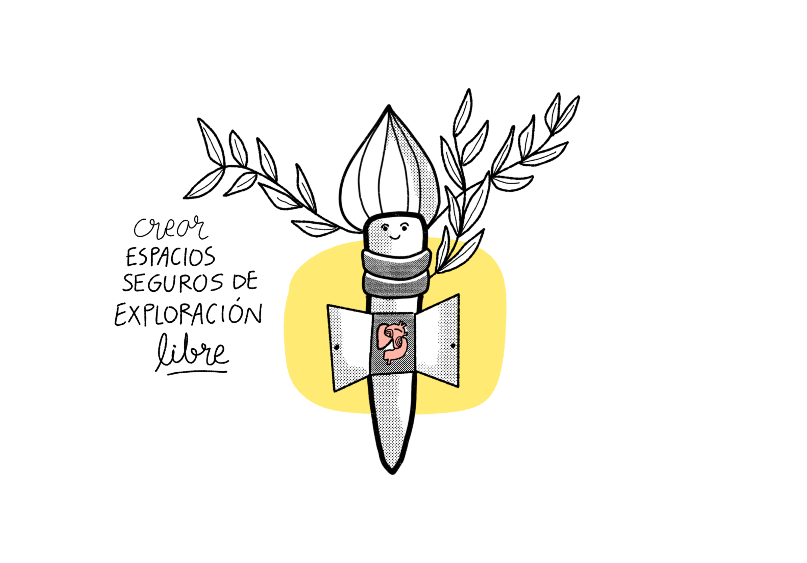
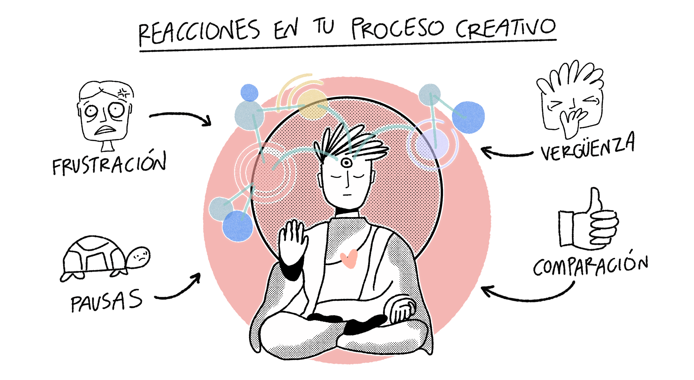

  III Laboratorio de exploración

En los capítulos anteriores platicamos sobre **la creatividad como una habilidad humana** que podemos desarollar a conciencia, platicamos lo importante que es **resignificar nuestra autoconcepción** y darnos la oportunidad de **valorar nuestros actos creativos**. 

A medida que seamos más **honestos y sinceros con nuestros procesos creativos** encontraremos esos diferenciadores únicos y distintivos que forman parte de nuestra **originalidad.** 

En las fases exploratorias donde empezamos a explorar los alcances de nuestros actos creativos **necesitamos de un espacio de intimidad y un espacio seguro donde podamos experimentar con total libertad**. 

Esto puede ser un gran aliado y compañero si se desarrolla a conciencia, por ello te invito a trabajar en **crear un laboratorio de exploración propio**. Si bien no hay una definición de qué es o cómo se ve, las siguientes ideas y propuestas podrán guiarte para crear tu laboratorio de exploración a tu medida. 

<!-- Note begin -->

  <!-- Your text here!!! -->
  Considera crear un espacio donde puedas crear con libertad.

<!-- Note end -->

## El pacto de tu laboratorio creativo

Con el paso de la experiencia he visto que el bloqueo más importante para adoptar nuevos procesos creativos tiene que ver con **un tema cultural de cómo afrontamos a aprender nuevas cosas.** Muchas personas se descalifican porque creen que necesitan algún nivel de dominio sobre algo, más aún si el tema se conecta con lo artístico, como hemos platicado anteriormente. 

Empezar por un **pacto con tu laboratorio creativo** tiene por objetivo conscientizar **las emociones difíciles** que afrontaremos durante nuestros procesos de aprendizaje. Durante el camino tendremos momentos complicados que nadie nos enseña **que se pueden atravesar desde lugares diferentes**. Te invito a leer y releer varias veces para que puedas hacer tuyo este pacto, que puedas modificarlo a tus necesidades y usarlo como **un motor guía** en lo próximos pasos de tu camino. 

<!-- Note begin -->

  <!-- Your text here!!! -->
  Este pacto es un contrato entre tú y tu creatividad.

<!-- Note end -->

1. Acepto que **habrá frustración** como parte del proceso que me hará saber que **estoy trabajando en mis límites conocidos**.
2. Acepto que **mi ritmo creativo lleva pausas y tiempo muerto**, que avanzo y **crezco en la paciencia**.
3. Acepto que **sentiré momentos de verguenza** sobre mi trabajo, pero recordaré que es una **reacción que aparece cuando estoy siendo sincero y auténtico.**
4. Acepto que **ningún otro camino invalida el mío.** Voy a **mi propio ritmo**. 
5. Acepto que **la mejor versión de mi no es ser una máquina de producir** sino una **mente curiosa** en práctica. 

Muchos de los artefactos que estamos usando, **como el manifiesto, el juramento y el pacto**, son parte de una forma de ver el mundo que nos rodea que pueden **extrapolarse a cualquier otro ámbito**, que puede ser el profesional, el personal, el de tus relaciones. A medida que inviertas tu tiempo y corazón en tu propio desarrollo creativo verás que descubrirás nuevas formas de operar en muchos ámbitos.

## Tu laboratorio es un ritual

Aunque vivimos en un mundo digital donde nuestras principales herramientas son apps y agentes de IA, te propongo que para darle forma a tu laboratorio de exploración utilices **una libreta física**. 

<!-- Note begin -->

  <!-- Your text here!!! -->
  Los objetos físicos nos permiten tener procesos de aprendizaje diferentes y profundos.

<!-- Note end -->

Tu laboratorio puede ser:
- Una **libreta** que te guste, puedes forrarla a tu gusto, ponerle stickers, de la forma que mejor te acomode. 
- Un **espacio** en tu escritorio que además incluya un set de plumas, plumones, y papelería que quieras usar. 
- Puedes encontrar inspiración buscando _journaling_ o _junk journals_. 
- Ten **libertad de incorporar los elementos que más te gusten e inspiren** para hacer tu lugar creativo, puede ir desde ser solo una libreta con tu pluma favorita hasta un escritorio con muchos plumones y decoraciones. Conecta con tu propio gusto y placer.

Insisto en que **tengas una libreta física como tu laboratorio de ideas** porque hay algunas consideraciones del objeto físico sobre el objeto digital. Cuando involucramos las manos al momento de escribir, decorar, dibujar, incluso al manipular, **creamos conexiones sensoriales y emocionales que no son fáciles de emular digitalmente**. El objeto físico puede evolucionar en un **ritual de conexión**, por eso lo importante de que tu libreta sea algo que te guste y te de placer de tener. Las **emociones** que comienzan a fluir son **parte de tu proceso creativo**, cada página se convierte en evidencia de práctica real, es como tener un diario íntimo tuyo, tú decides si lo muestras o no, no tiene que complacer a nadie ni ganar _likes_ ni _views_, es **tu espacio personal**.

De cierta forma **lo físico crea estados mentales** que permiten fluir de manera diferente tus pensamientos. Los objetos, la conexión entre ellos, el ecosistema que se crea en sinergia alimenta tus ideas inconscientes. Al limitar tu actividad a un cuaderno que tiene una forma definida y un límite de páginas hace que tu creatividad funcione diferente.

<!-- Note begin -->

  <!-- Your text here!!! -->
  "Mientras más me limito más me libero", Jorge Drexler.

<!-- Note end -->

## Tu lugar seguro

La idea detrás de tener un **laboratorio de exploración** es crear un espacio **íntimo y seguro** de experimentación. A medida que decidimos entendernos como seres creativos nos enfrentaremos a **una cultura que castiga mucho la experimentación, el error, el proceso lento y el fracaso**. Para ello te invito a que este ejercicio sea también un momento para **reconocer tu mirada y tu voz propia** a través de tus aciertos y errores, de tus virtudes y defectos, que puedas **espejear** quién eres a través de tus creaciones y ahí encuentres tu narrrativa propia y tu discurso.

Tu laboratorio de exploración **debe ser un lugar para permitir el error y la experimentación**, pero también **disfrutar el proceso** con placer y curiosidad. Este espacio será el **refugio de las ideas** buenas, regulares y malas que vayan naciendo de ti, y tú serás su protector. 

Algo que suelo hacer durante mis sesiones de entrenamiento es apoyar a mis alumnos a aceptar el caos como parte del proceso, he visto como muchas personas se liberan de la presión de _hacerlo bien_ cuando integran la posibilidad de jugar con el caos y los errores como parte de su proceso de exploración, no hay algo _bueno_ o _malo_, hay _experimentos_ que nos ayudan a encontrar nuestras mejores herramientas. Cuando se adopta la mentalidad de aceptar el caos, viene la siguiente lección: aceptar los espacios vacíos. Los espacios vacíos serán un gran aliado en nuestra exploración visual creativa como lugares que representan escucha, intenciones no formuladas y preguntas no hechas. 

**Todo lo que alimente nuestra libertad creativa para explorar es bienvenido.**
## Durante el camino

Muchas veces valoramos más el final del camino sobre el propio camino. Te propongo que pongamos más atención **al proceso sobre el fin**. Es muy importante acompañar este recorrido creativo con tu desarrollo emocional, son **las emociones del camino** lo que te darán mejores indicios de donde desarrollar más o donde trabajar ciertas áreas de oportunidad.

<!-- Note begin -->

  <!-- Your text here!!! -->
  La creatividad visual es un acto de reconciliación.

<!-- Note end -->

Aprender a **resignificar estados emocionales** es lo que impulsará nuestra actividad creativa, así que me dí a la tarea de estructurar algunas emociones que probablemente sentirás y cómo darles un _giro de tuerca_ que te permitan ver la situación desde otra mirada.

- **Frustración**: a veces podemos llegar a sentirnos que las cosas "no salen como queríamos", cuando esto pasa es una señal de que estamos trabajando en nuestros límites conocidos y que tal vez es una oportunidad para ampliar nuestras habilidades. 
- **Impaciencia**: ¿te haz llegado a sentir que tus procesos son lentos? Tal vez es un indicio de un choque entre la fantasía y la realidad, permite que tus procesos lleven su ritmo y su cadencia sin una expectativa.
- **Comparación**: será muy natural llegar a compararnos con otras personas y sentir que vamos tarde o vamos despacio. Esta es una señal de que tal vez estamos cayendo en un exceso de comparación. El camino creativo es personal y único, no es una competencia
- **Aburrimiento**: con el paso del tiempo, la constacia y la práctica podrías llegar a sentir que algunos ejercicios son muy sencillos, cuando esto pase es momento de subir la dificultad.
- **Vergüenza**: este es un clásico, muchas personas suelen sentir pena de mostrar sus ideas y bocetos, aún cuando están en fases exploratorias, es muy normal y entendible, la vergüenza aparece cuando tu trabajo es auténtico y sincero, es una forma de vulnerarte, eso lleva tiempo y cuidado.
- **Apatía**: muchas veces podríamos a llegar a sentirnos abrumados de nuestros procesos creativos y esto nos puede llevar a pensar que no tiene caso continuar. Cuando esto suceda tal vez tiene que ver con sentir que no vemos frutos visibles de nuestro esfuerzo, descansar y tomarte tu tiempo también es parte del camino.

Te invito a que condenses estas ideas en una libreta especial que servirá para contener **tu laboratorio de exploración**. Antes de empezar a vaciar tu pensamientos ahí era necesario establecer los lineamientos. 

Nada esta escrito en piedra, y eres libre de buscar el material que mejor te acomode y adaptar las ideas de este capítulo a tu manera y a tus necesidades. 

