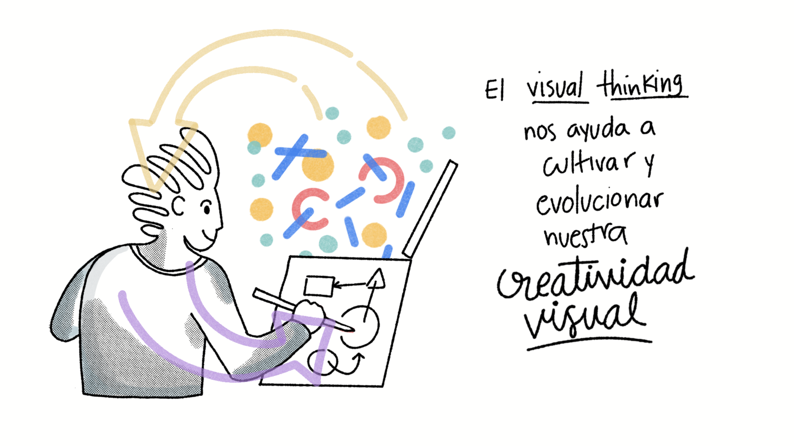
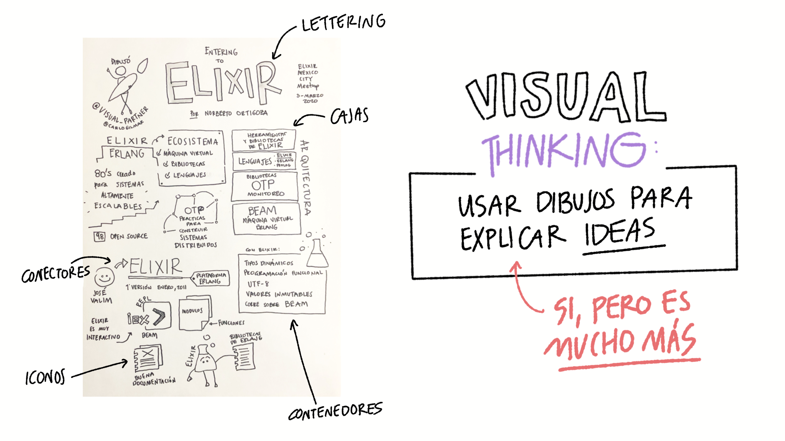
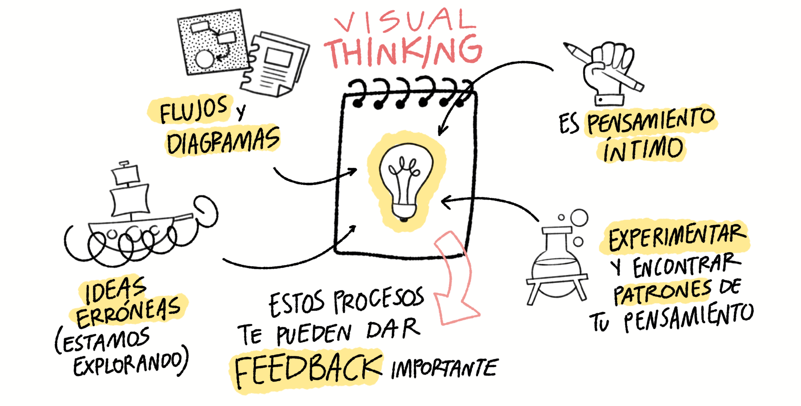
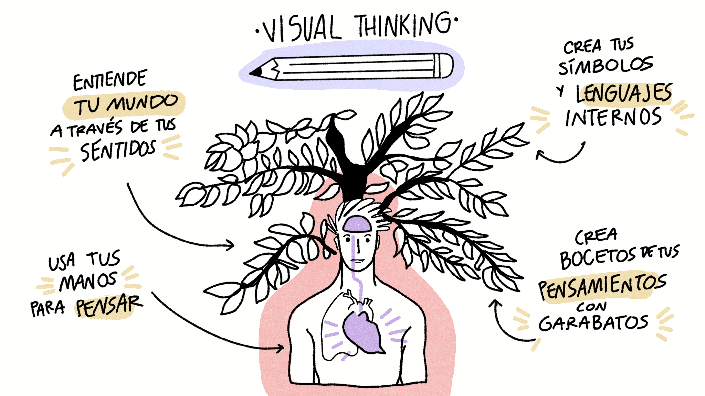
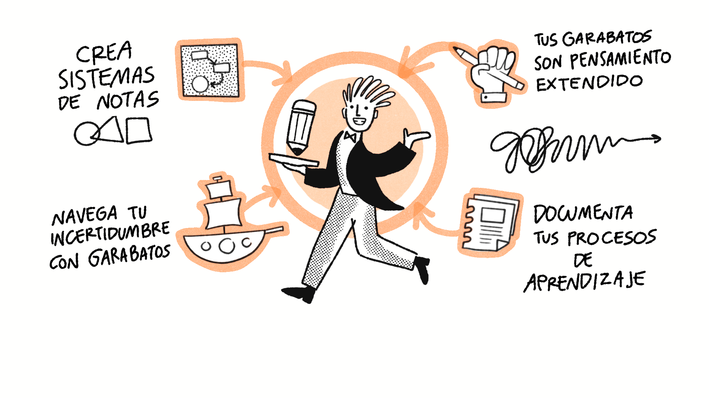
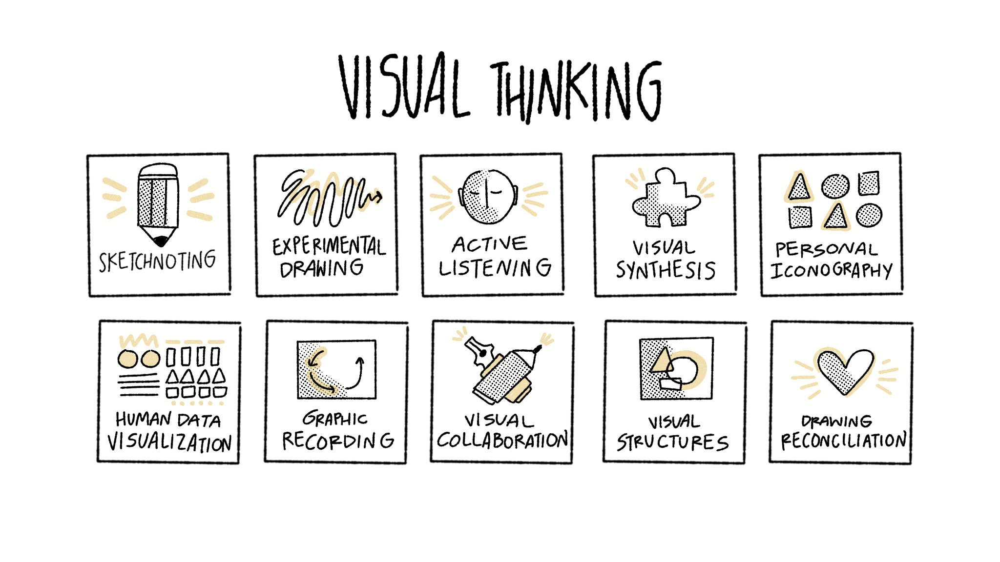

  IV Visual Thinking: pensar con garabatos

En el primer capítulo te propuse **replantear y resignificar el tema de la creatividad** como una cualidad humana que **poseemos en nuestra genética**. En el segundo capítulo platicamos de cómo **hay un espectro de creatividades** donde podemos encontrar la creatividad visual como una forma de **codificar experiencias, resolver problemas y crear una relación personal con nosotros mismos**. En el tercer capítulo te plantee la creación de un **laboratorio de exploración**, un lugar donde puedas experimentar y dejar fluir tus ideas libremente, cuál terreno fértil para entrenar **tu creatividad visual**.

Tal vez para este punto te preguntes **cómo entrenar y cultivar tu creatividad visual**. Lo fascinante del mundo del arte es la cantidad inmensa de diferentes enfoques y percepciones que pueden existir, es el espectro más grande y flexible que podemos aprovechar para adaptarlo a nuestras necesidades. 

El **pensamiento visual** o _visual thinking_, como le llamaremos a partir de ahora, es la habilidad que nos ayudará a entrenar y evolucionar nuestra creatividad visual.

## El pensamiento visual

El **visual thinking** es un término comúnmente definido una **metodología o técnica para organizar, comunicar y comprender ideas o conceptos mediante representaciones visuales** simples combinados con texto. Aunque no existe una definición en común, las descripciones que puedes encontrar en la red más o menos tienen que ver con esta idea, la de explicar conceptos con dibujos. 

Con el paso del tiempo, a medida que he podido experimentar con diferentes técnicas y en mi experiencia como programador de software que usa _visual thinking_ para construir sistemas, he encontrado un sin fín de utilidad, pero he encontrado mayor profundidad al combinar mi propio proceso terapeútico y creativo con la habilidad del pensamiento visual. 

Cuando me toca preparar talleres y pláticas sobre este tema suelo tratar de documentarme para ver cómo enriquecer esta definición y poder expresar lo mucho que me ha ayudado profesional y humanamente. Poco a poco he experimentado en diferentes disciplinas como la pintura en acrílico, con acuarela, estudiando a artistas como Kandinsky, como Keith Haring, o Basquiat, o incluso incursionando en el cabaret y el burlesque. Todos los aprendizajes que he experimentado los he tratado de documentar y condensar en mi propio pensamiento visual. 

El _visual thinking_ me **ha ayudado a cultivar mi creatividad visual**. He dibujado instrumentos visuales para mi trabajo, para mis redes sociales, para mis proyectos, para mi terapia, para mis amigos, he dibujado feliz, triste, con lágrimas en los ojos, solo, en compañía, en clase, como instructor, como speaker, de una y mil maneras. De cierta forma al desarollar mis habilidades creativas llega un punto donde se combinan con tus demás habilidades.

Este material que tienes en las manos es resultado de mi experiencia como _visual thinker_ y como instructor. Mientras más trabajo en **mis procesos íntimos con sinceridad**, soy capaz de ser más empático con las personas que me permiten que los guíe en sus procesos creativos. De aquí es donde he podido enriquecer mis definiciones y crear mi propia metodología de trabajo. 

Para mí el _visual thinking_ **no tiene que ver necesariamente con saber dibujar**. El internet suele confundir trabajos de _sketchnoting_ (tomar notas a mano) con trabajos de _visual thinking_ y es muy fácil caer en la definición de que sólo se trata de dibujar conceptos con imágenes. Caer ahí es caer en una generalización que deja fuera el detalle profundo de este mundo. 

El **visual thinking es pensamiento activo**, es involucrar tus sentidos físicos y tus estados emocionales. **El trazo aparece como un medio** que nos permite extender y visibilizar el pensamiento. Puede ser tan complejo como visualizar nuestras rutas de pensamiento. ¿Cómo se ve lo que piensas? ¿Cómo se ve lo que sientes? A través de **símbolos** concretamos ideas que representan pensamientos en movimiento. El trazo de garabatos es entonces un paso final, solo después de haber materializado en imágenes mentales y símbolos lo que pasa por la cabeza y el corazón. El **medio es el mensaje** como dice Marshall McLuhan.

<!-- Note begin -->

  <!-- Your text here!!! -->
Visual Thinking es pensar con garabatos imperfectos que funcionan como un espejo mental y emocional, una guía de aprendizaje y evolución de tu percepción. Es una forma de aterrizar tus pensamientos en papel para darte cuenta de lo que no se ajusta, de hacerte preguntas, cuestionarte y diseñar nuevas formas de entenderte. 
  

<!-- Note end -->

## Tus garabatos son el medio

Hablar de pensamiento visual es hablar de **entunaender profundamente nuestra forma de pensar**, hemos aprendido a castigar la incomprensión y el lento aprendizaje en favor de valorar más la _rapidez_ y la _productividad_. 

Cuando menciono que los procesos **visual thinking** se nutren de la sinceridad y honestidad es debido a que los artefactos que podemos construir funcionan como un espejo que refleja nuestra forma de pensar, mientras más sinceros seamos sobre cómo vamos sintiendo y procesando la realidad tendremos una mejor aproximación.

El _visual thinking_ nos ayuda a reconciliar dudas, espacios en blanco e inferencias como parte de nuestro pensamiento, esto es clave porque serán el factor que nos ayudará a ir ajustando y validando sobre la marcha, la facilidad de **aprender técnicas para crear garabatos que interpreten nuestras ideas es una forma muy rápida y barata de validar ideas o hipótesis.** 

Cuando aprender a integrar estos elementos, entonces puedes ver reflejado tu proceso de pensamiento en algo tangible como un diagrama visual, a partir de ahí será más fácil y claro organizar y estructurar el contenido de tal forma que puedas bocetar la imagen completa o _big picture_ de lo que estás haciendo, de cierta forma **es como construir un mapa cartográfico que incluye no sólo elementos estructurados, sino también espacios en blanco, preguntas y dudas.**

La práctica y la experiencia desarrollan patrones y estrategias, pero aún así la forma de desarrollar este tipo de procesos es totalmente abierta y diversa. A medida que **enriqueces este tipo de guías y te apropias del concepto** desarrollarás mejores técnicas adaptadas a lo que necesitas.

Trabajar con el trazo y los garabatos, una vez que acomodas las cuestiones del miedo al error y adoptas la **mentalidad de explorador**, puede ser una gran herramienta para tu día a día. 

Y como cualquier otra habilidad, **se necesita inversión de tiempo y practica.** Si bien el trazo y el dibujo no es central, sin duda ayuda mucho desarrollar estas habilidades. 

El retorno de inversión lo verás en **tu capacidad de ilustrar tu pensamiento en varios formatos, podrás crear tus propios sistemas de notas, navegarás momentos de incertidumbre a través de mapas que expresen los espacios en blanco y las preguntas que tienes, documentarás tus procesos con sinceridad y autenticidad**, y estarás relacionandote con el mundo que te rodea desde otra mirada, una donde te permites experimentar con curiosidad y paciencia. 

Hay varias técnicas y habilidades auxiliares que puedes desarrollar mediante el _visual thinking_, no existe una guía definitiva ni un criterio establecido, y esta selección es parte de mi experiencia profesional:

- **Sketchnoting**: desarrolla un estilo particular de tomar notas a mano.
- **Experimental drawing**: trabaja con tus manos y su pulso para capturar emociones.
- **Active listening**: aprende a desarrollar tu escucha activa.
- **Visual Synthesis**: desarrolla síntesis de ideas a partir de conjuntos de símbolos.,
- **Personal Iconography**: crea una galería personal de íconos.
- **Human Data Visualization**: inspírate en la obra de Giorgia Lupi y su forma tan práctica de comunicar datos a través de visualizaciones.
- **Graphic Recording**: captura, traduce e interpreta información en tiempo real.
- **Visual Collaboration**: desarrolla estrategias visuales de colaboración para equipos de trabajo.
- **Visual Structures**: aprende a ir de lo particular a lo general y viceversa a través de explicaciones visuales.
- **Drawing reconciliation**: crea mapas de emociones personales que te ayuden a conocerte profundamente.

Hablar de este tema es fascinante y sin duda da contenido para escribir un libro de muchos tomos. 

En el siguiente capítulo encontrarás algunas estrategias donde pondremos a prueba todo lo que hemos platicado sobre la creatividad visual. Estas estrategias han sido diseñadas para ser ejercicios muy puntuales de _visual thinking_ que te ayudarán a desarrollar tu creatividad visual, sin embargo a medida que puedas desarrollar más habilidades del visual thinking podrás desarollar más y mejores instrumentos visuales. 

