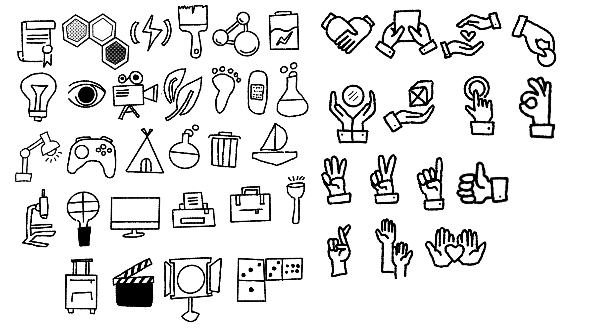
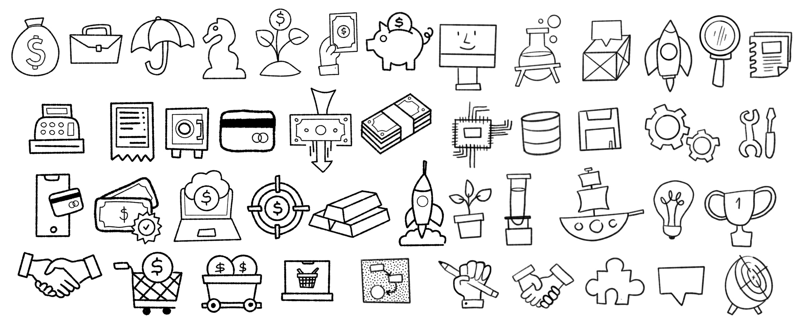
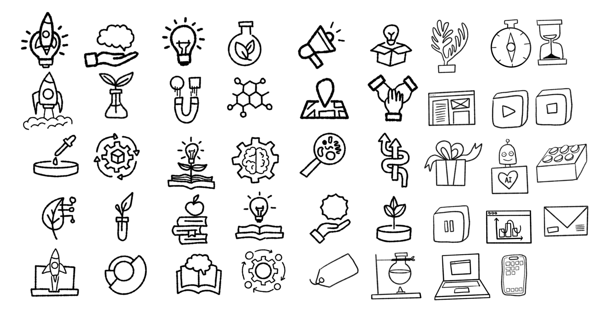
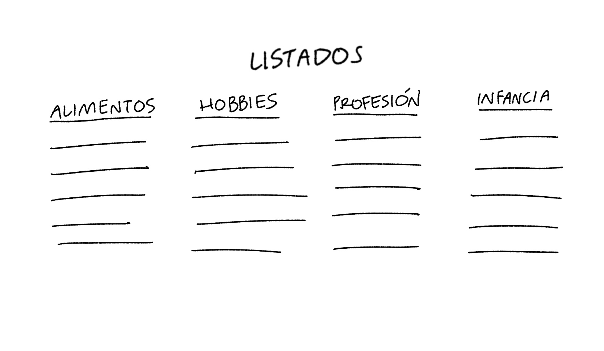
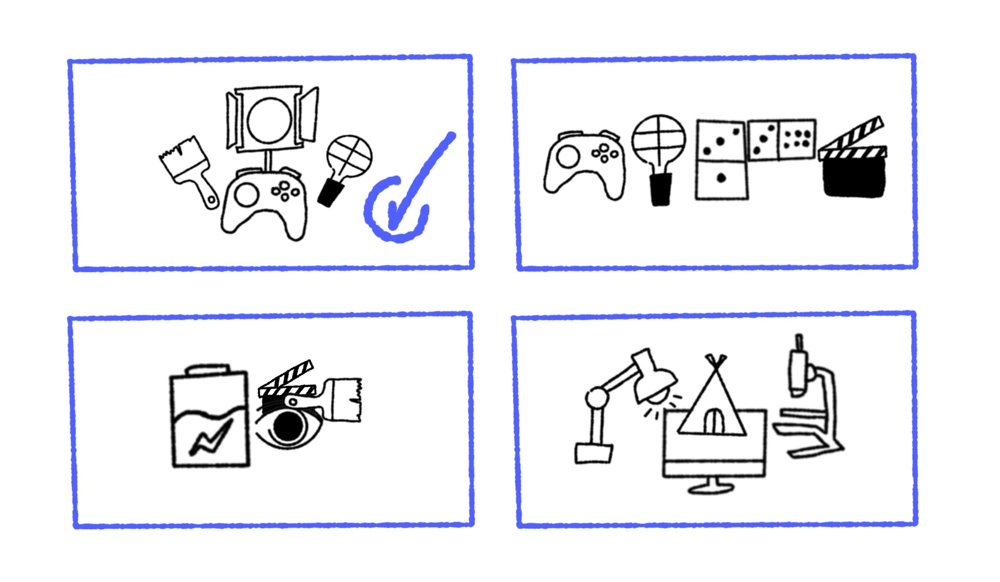
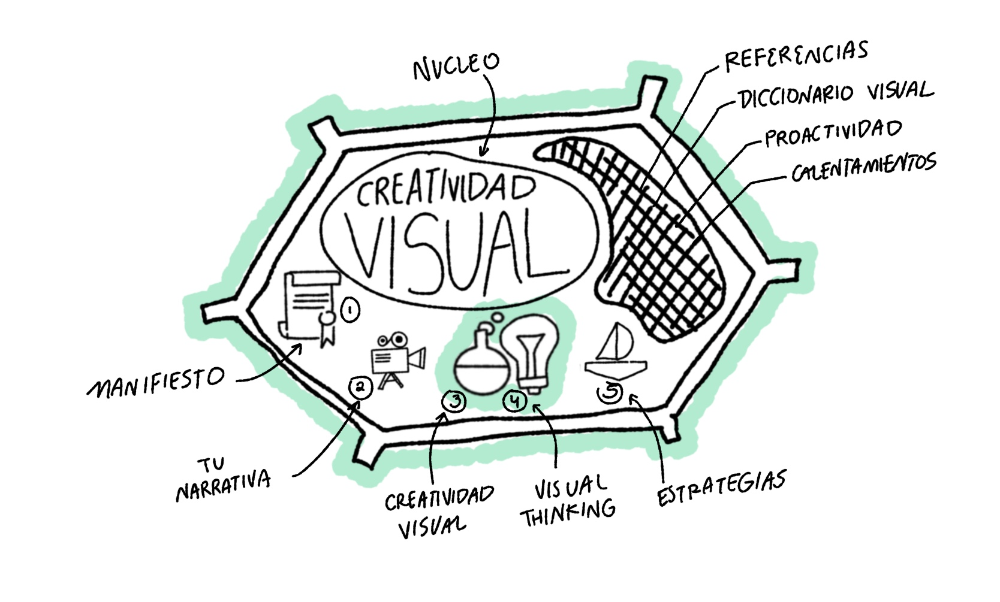
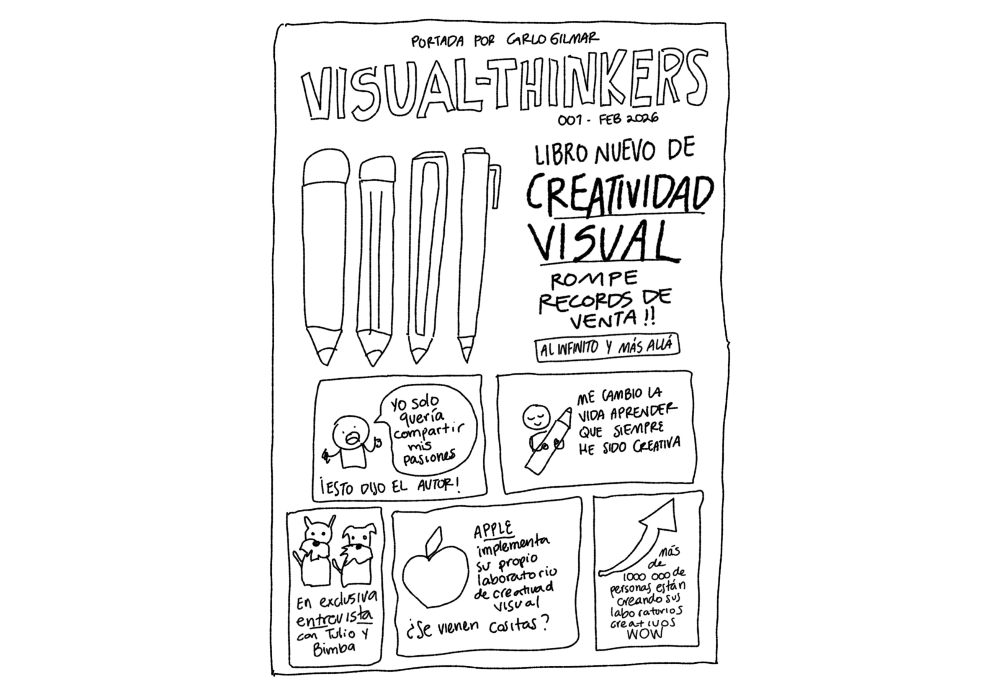
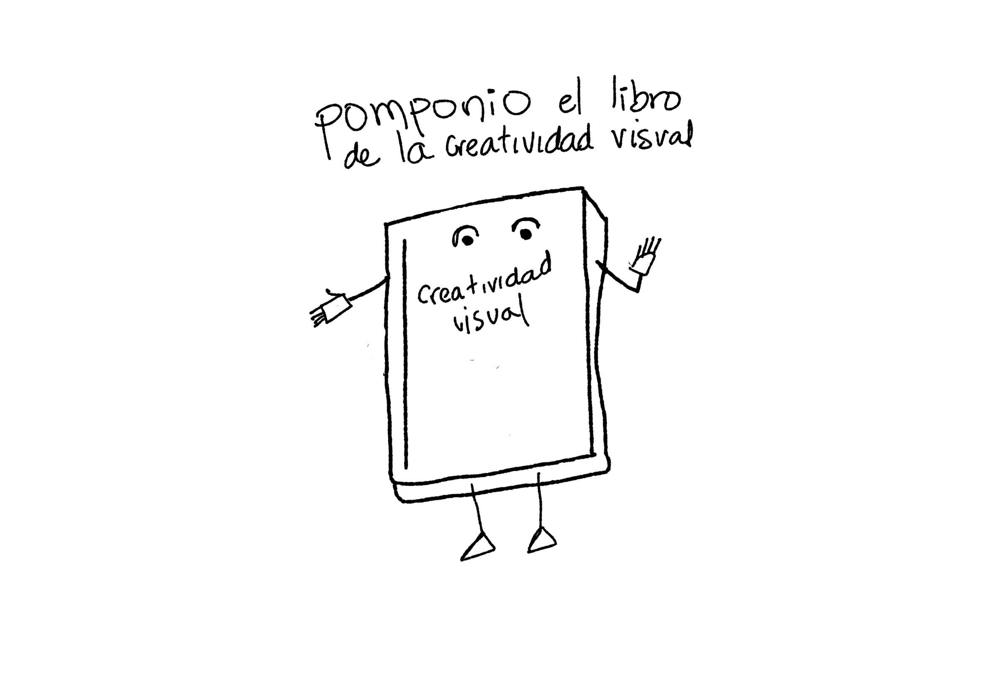
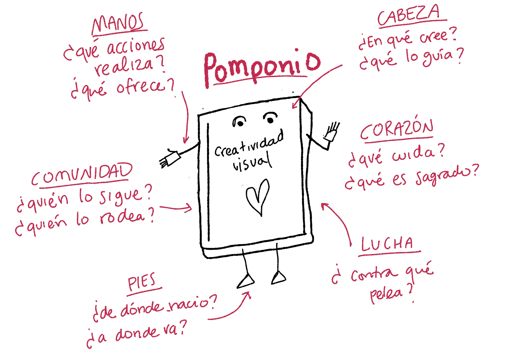
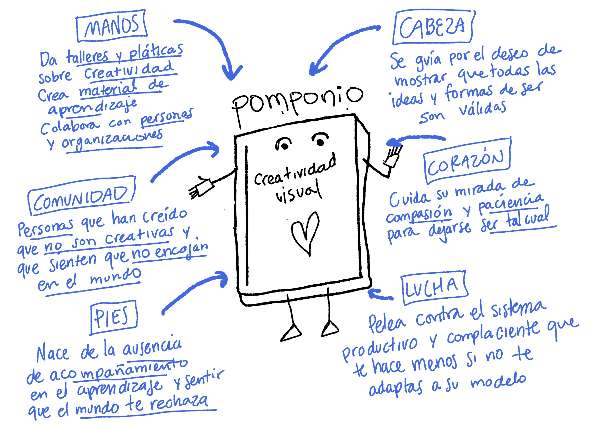

  V Estrategias visuales para no-creativos

                                           

ok - tu escudo personal
ok - La célula organizacional: estructuras sistémicas
ok - Revista: Volver al futuro: visualizar futuro inmediato como hipótesis

- El personaje en situación: narrativa y mapa de empatía
- Galería de íconos colectiva (colaboración)
- Boceta tu problema
- mermelada gráfica: dibujar símbolos de un concepto ->
- Mapa histótico - línea de tiempo
- Orden del día visual
- Antemortem: visualizar cómo terminará mal aqui descansa
- Red visual de valores
- Mente, corazón, mano
- Producto pinocho, hacer de la situación un amigo
- La lancha motora: frenos y bloqueos de un proyecto

## Diccionario visual 

Las estrategias visuales son actividades donde necesitas dibujar para desarrollar tu pensamiento visual, sin embargo también es un proceso complicado de inicio. Recuerda: no necesitamos dibujar bonito y perfecto, el garabato que seamos capaces de trazar será más que suficiente.

La buena noticia es que este material de aprendizaje es para aprender desde cero, por lo que preparé para ti una selección de íconos que puedes apropiarte y darte una idea de como dibujar los tuyos. Usa estos símbolos en las actividades y siéntete libre de añadir nuevos o modificarlos a tu gusto. 

Te recomiendo mucho que en una hoja aparte puedas copiar a tu estilo todos estos íconos y los tengas a la mano cuando realizes tus actividades.

## Estrategia 1: Mi bandera personal 

> Construir una bandera personal de símbolos que condense quién eres y qué te gusta como un artefacto de autoconocimiento y originalidad que puedes usar como marca personal. 

**Paso 1: listados sobre ti**

Primero vamos a crear listados de cosas y experiencias significativas para ti, trata de no pensarlo mucho, lo primero que te venga a la mente es suficiente. 

- Haz un listado de 5 alimentos que te guste comer (tacos, galletas, pan dulce, bebidas).
- Haz un listado de 5 hobbies o actividades que disfrutas hacer. 
- Anota otro listado de 5 actividades que más te gusta de tu profesión.
- Escribe un listado final de 5 actividades que recuerdes de tu infancia. 

Al final tendrás 20 ideas diferentes repartidas en cuatro secciones.

**Paso 2: selección de tus ideas favoritas** 

Elige tu idea favorita de cada listado y márcala, serán 4 ideas seleccionadas. Para cada una de esas 4 ideas núcleo, piensa ¿qué objeto simple podría representar esto? ¿qué forma o ícono muy sencillo puedo usar?

- En una hoja vacía dibuja solo los íconos en el centro, será el corazón.
- Regresemos a tus listas y una a una agrega un dibujo que las represente y acompañen tus íconos núcleo.
- Tú decides cuantas agregar, mientras más agregues mejor será.

**Paso 3: contemplación**

Una vez que concluyas tu mapa de símbolos personales es importante que lo veas y te preguntes:

- ¿Qué símbolo se siente más “yo” ahora mismo?
- ¿Qué símbolo viene de una parte de mí que he descuidado?
- ¿Qué hay del niño/niña que sigue vivo en este escudo?
- ¿Qué símbolos casi no aparecen y me sorprende (por ejemplo, juego, descanso, curiosidad)?
- ¿Qué símbolos dibujaste con mayor presencia?
- ¿Los íconos se relacionan entre sí o se sienten separados? 

**Paso 4: diseño**

Una vez que terminaste de traducir visualmente tus listados es importante darte el tiempo de examinar sin juicio tu resultado, esto es un espejo de cómo te ves y sirve para darte cuenta de aquellas ideas que resuenan más contigo.

- Elige 4 ideas/íconos del paso anterior que mejor te representen, pueden ser tus ideas núcleo o puedes sustituir por otras que resulten tener una mejor conexión.
- Dibuja en una hoja nueva 4 rectángulos iguales. 
- Adentro de cada uno dibuja de nuevo tus nuevas 4 ideas favoritas, crea 4 variaciones diferentes, juega con el acomodo, juega con las dimensiones, y trata de relacionarlos de cierta forma.
- Al final elige la bandera que más te guste y te represente. 

Listo, a través de este ejercicio de exploración habrás diseñado un escudo visual que puede servir como una marca personal. Este es un acercamiento que puede ir evolucionando y puliéndose con el paso del tiempo. Incluso si sientes que faltaron íconos que te gustaría agregar, eres libre de expandir estos experimentos.

## Estrategia 2: La célula vegetal

> ¿Recuerdas tus clases de biológia cuando te dejaban hacer la maqueta de una célula vegetal? Piensa que cualquier sistema que quieras entender (un equipo, un proyecto, tu rutina) lo puedes ver como una célula. Una célula tiene diferentes componentes: el núcleo, los organelos, la membrana, etc. ¿Cómo diseñarías tus ideas bajo esta estructura?

1. Define el núcleo. Identifica el tema central que quieres desarollar. No importa si no es del todo claro. 
2. Identifica los componentes clave que conoces. Realiza una lista de los componentes más importantes que identifiques y conviértelos en un ícono. Todos estos serán los organelos. 
3. Nombra lo que no conoces: realiza una lista de ideas sueltas que sabes que existen pero no conoces del todo. Estás ideas al no estar definidas serán parte del citoplasma.
4. Tras definir el núcleo, los organelos y el citoplasma podemos ahora crear nuestra célula vegetal.

El objetivo es visualizar tu proyecto como una estructura celular que te ayude a validar qué tanto entiendes ya, ver qué partes faltan por definir y a detectar componentes desproporcionados (muy grandes o muy pequeños).

Como primer avance puedes elaborar la estructura como el siguiente ejemplo:

Y después puedes agregar color y texto para complementarlo. 

Puedes cerrar el ejercicio haciéndote estas preguntas: ¿qué organelo estoy sobrecargando? ¿qué parte importante falta dentro de la membrana? ¿qué elementos del citoplasma necesitan convertirse en organelos definidos?

## Estrategia 3: Portada de revista

> A veces necesitamos jugar con el humor y la exageración para encontrar grandes y divertidas ideas que nos permitan ampliar nuestra perspectiva. ¿Si tuvieras que imaginar tu proyecto en grande, cómo sería? ¿que te gustaría que la gente dijera de él? ¿qué te gustaría que sea lo más importante? 

Imagina por un momento que eres el editor de la revista _Visual Thinkers_ y necesitas diseñar la portada de tu siguiente edición. ¿Alguna vez haz realizado un _vision board_ para intencionar tus acciones futuras? Este ejercicio se trata de imaginar el futuro que deseas en grande como motivación y dirección de tus ideas. Juega con tu imaginación.

1. Elige tu tema central. 
2. Considera que la portada lleva una imagen central que representa el mayor impacto de tu tema. Recuerda el manifiesto: no es ilustración bonita, es símbolo honesto.
3. Incluye un titular que hable de tu tema, como las portadas de revista de espectáculos.
4. Incluye detalles humanos para bajarlo a tierra. Puedes incluir citas como: _“Nunca pensé que un simple garabato cambiaría cómo entiendo mis ideas.”_,  _“Lo que más me sorprendió fue darme cuenta de que siempre fui creativo.”_. En otro espacio, pon números simbólicos: _“Más de 1000 personas han usado su laboratorio de garabatos.”_, _“Equipos en 5 países han aplicado su método.”_. No hace falta que sean métricas reales, son metáforas visuales de impacto. Piensa más en bloques que en diseño bonito.

Al terminar, no la juzgues por estética. Úsala como espejo: ¿qué parte de esta portada ya está empezando a ser real? ¿qué parte se siente más lejana? ¿qué símbolo te da más energía? ¿qué te da un poco de miedo (porque implica crecer)?

## Estrategia 4: Tu idea personaje

> ¿Qué pasaría si tu proyecto fuera un personaje capaz de hablar, sentir y pensar? Esta estrategia es sobre dibujar tu proyecto como si fuera un personaje para ayudarnos a entender qué quiere, que no quiere, y hacia donde necesita ir.

1. Elige el proyecto-personaje y elige un nombre.
2. Puedes elegir un símbolo que represente tu proyecto y agregarle una cara, manos y pies. No necesita ser complejo. Juega con tu imaginación. En una hoja dibújalo al centro. 
3. Disecciona al personaje por partes: cabeza, corazón, pies y manos, usa el cuerpo como un mapa visual. Por cada sección habrá preguntas que contestar.
4. Cabeza de tu personaje: ¿en qué cree? ¿qué ideas lo guían?
5. Corazón: ¿qué es sagrado para tu personaje? ¿qué cuida?
6. Manos: ¿qué acciones realiza? ¿qué ofrece a las personas?
7. Pies: ¿de qué experiencias nació? ¿hacia donde quiere caminar?
8. Comunidad: ¿qué tipo de personas le rodean y siguen?
9. Lucha: ¿contra qué pelea este proyecto? 

Puedes inspirarte en el diccionario visual para encontrar algún dibujo que represente tu idea.

Esta vez usaremos el personaje como ilustración central de nuestra idea y alrededor haremos la lluvia de ideas.

Esta es una forma de bocetar una narrativa creativa. ¿Qué pasaría si combinaramos esta estrategia con la #1, si en vez de palabras usáramos íconos?

