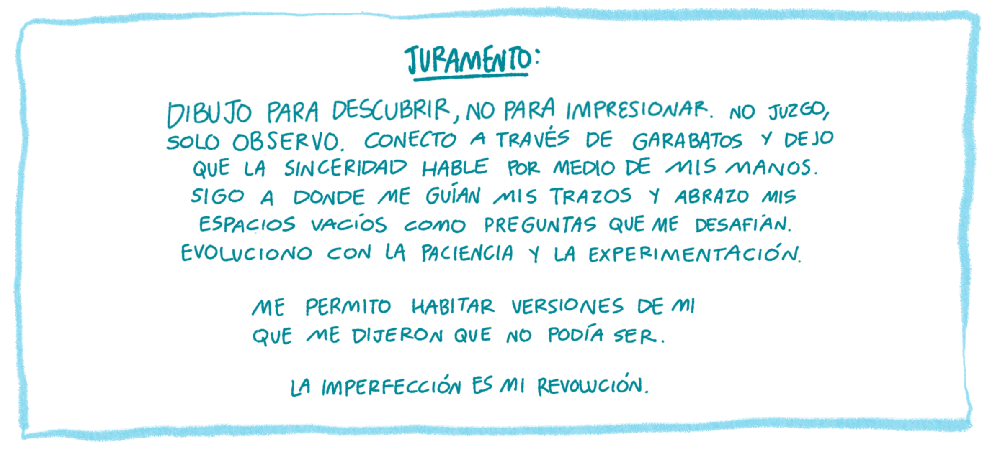
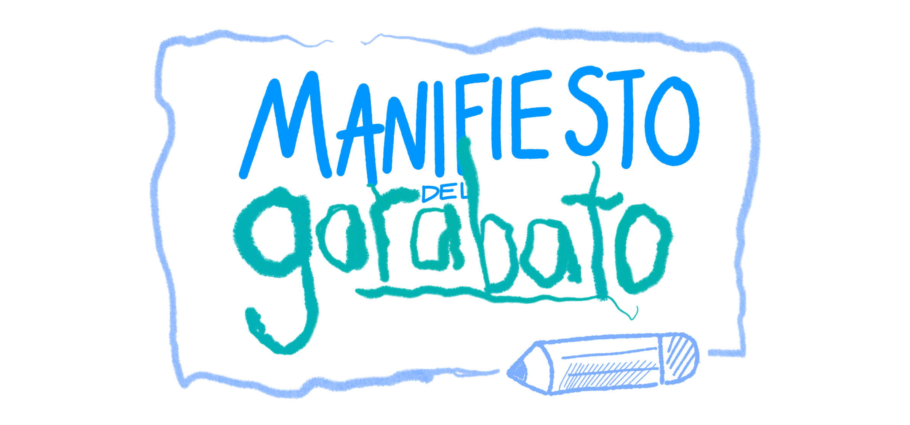
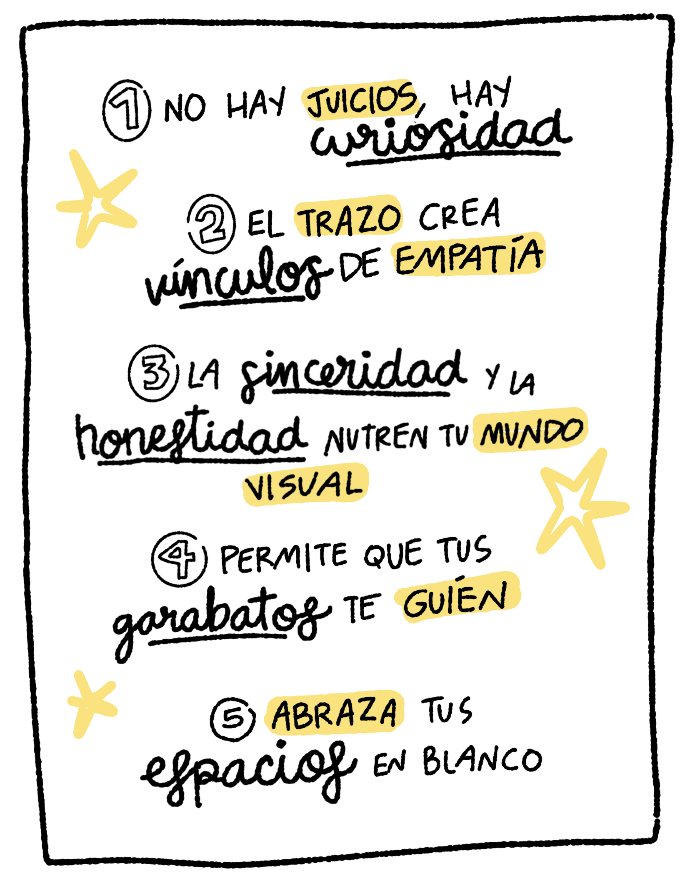
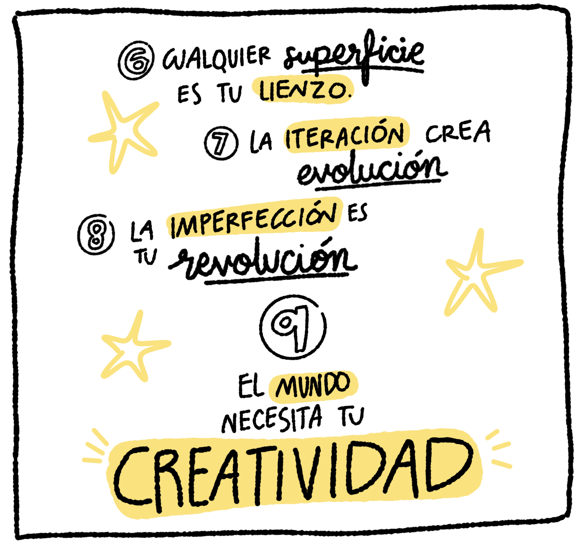
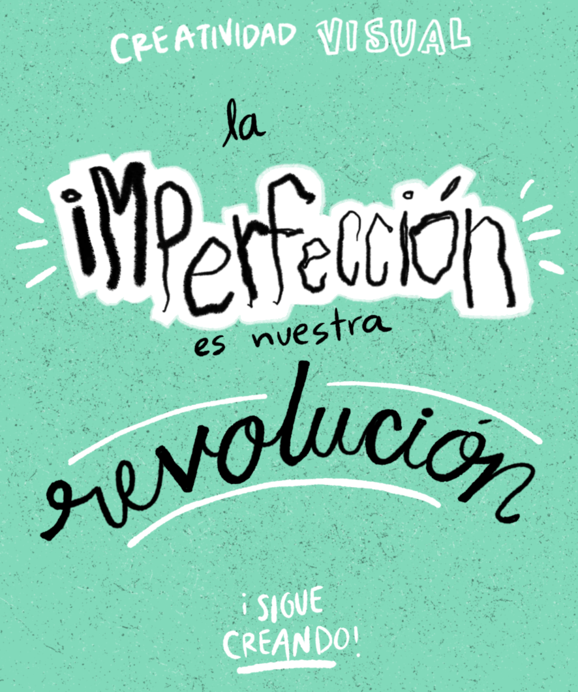

  Manifiesto del garabato 

**1. No hay juicios, hay curiosidad.**
Tus ilustraciones no son un examen, son un espejo. El juicio mata la curiosidad e interrumpe tu proceso creativo. ¿Quién define qué esta bien y qué esta mal? No hay un regla para crear. 

**2. Tus dibujos son puentes de empatía.**
Un dibujo honesto y sincero puede comunicar más que las palabras. La creatividad visual invita a otros a compartir mundos. Cada garabato es también una invitación a colaborar y a conectar. 

**3. La sinceridad nutre tu universo visual.**
Los bocetos reales y honestos revelan todo. Existe una magia en permitir que tu mano se exprese a través de líneas y formas que no encajen en lo esperado. Las líneas chuecas capturan partes importantes de ti, tu forma de crear garabatos es un espejo que refleja tu verdad personal.

**4. Permite que tus garabatos guíen tu camino.**
Deja de pelearte con replicar con exactitud estilos para tus garabatos. Tus garabatos, tus accidentes, tus líneas chuecas podrían guiarte a nuevos descubrimientos, nuevas ideas o nuevos caminos. Es tu subconsciente haciéndose presente. Tu mano puede saber más que tu pensamiento. 

**5. Abraza los espacios en blanco.**
Los espacios en blanco serán frecuentes, más que ser espacios por ser llenados, son maestros disfrazados de preguntas que te invitan a desafíar lo que sabes y lo que ves. Son preguntas esperando a ser preguntadas. Permite que existan en tu lienzo. 

**6. Cualquier superficie es tu lienzo.**
La creatividad visual no pide permiso para manifestarse, cualquier lugar y cualquier material es óptimo para dejar que tus manos hagan su magia.

**7. La iteración crea evolución.**
Dibujar varias veces no solo es repetición, es crecer de manera visible. A medida que te das permiso de recrear tus propios garabatos encontrarás detalles nuevos que te acercarán o alejarán de tu objetivo. 

**8. La imperfección es tu revolución.**
Los garabatos imperfectos se resisten al pensamiento automático. No necesitas complacer a nadie en este mundo, tú mundo. Permitirle a tus garabatos existir es permitirte dejar ser. 

**9. El mundo necesita tu creatividad.**
En un mar de contenido perfecto y voces uniformes, tus garabatos sinceros y tu mundo original y único son la voz que pueden transformar el mundo. No esperes permiso. El mundo cambia cada que tu lo dibujas.

