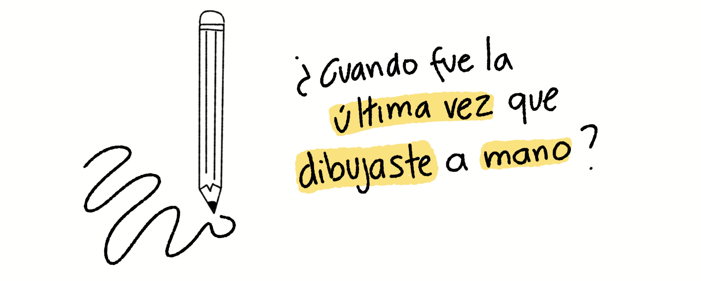

  La creatividad visual

El material que tienes en tus manos es un texto ilustrado que condensa muchos aprendizajes que he experimentado como practicante visual y como instructor de _visual thinking_.

Cuando diseño experiencias de aprendizaje me gusta pensar en el maestro que me hubiera gustado tener, en el guía del que me hubiera gustado sentir su compañía y calidez, en el instructor que me tratara con paciencia y motivación.

Al platicar con mis alumnos me he dado cuenta que muchas veces los mayores bloqueos no tienen que ver con escribir y dibujar, sino con darse el permiso de volver a ser principiantes, de explorar territorios nuevos con curiosis y de perder el miedo a no hacerlo bien. 

Es impactante darse cuenta que la cultura de aprendizaje en la que estamos inmersos nos quita parte de nuestras posibilidades. Y he visto como trabajar con estas concepciones implica un trabajo profundo pero de mayor impacto, por ello este texto es retador y confrontativo, quise escribir este material como una guía para tu curiosidad que despierte inquietudes en ti y te brinde una nueva forma de pensar, la del _visual thinking_.

En la primera parte encontrás algo muy importante que es **el manifiesto del garabato**, este fue producto de mi paso en el Campo de Juego de Luan de noviembre del 2024, es un conjunto de valores y principios que te propongo para explorar este material que seguro te retará.

El capítulo 2 es sobre la importancia de conocer nuestra cultura y nuestras **concepciones sobre la creatividad**. El capítulo 3 aborda el tema de la **creatividad visual** y cómo todos la tenemos. 

El capítulo 4 habla de crear un **laboratorio de exploración**, un lugar físico donde puedan existir libremente tus ideas, para pasar al capítulo 5 que trata sobre qué es el **visual thinking**. Y finalmente el capítulo 6 es un conjunto de estrategias con las que puedes aplicar todo lo anterior. 

Este libro es a su vez un homenaje a el cariño y pasión que le tengo al **visual thinking**, sin duda mi crecimiento personal se ha visto condimentado por mi creatividad visual, y esta es mi forma de compartirlo contigo. 

Deseo que estas páginas abran tu pensamiento, desafíen tus creencias y conecten con tu corazón. 

Si tienes algún comentario, petición, o feedback en general que hagan mejorar este material, te agradeceré mucho que me lo compartas a través de mis redes sociales en **@visual_partner** o bien al correo **visualpartnership@gmail.com**.

_Happy drawing!_ Carlo.