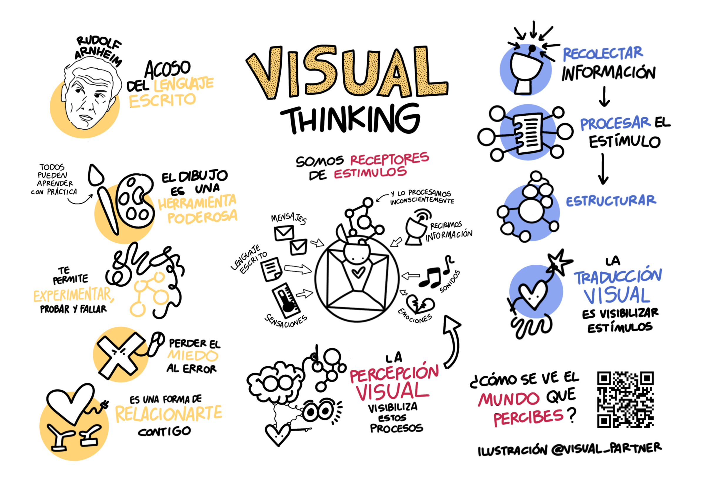

# La Creatividad Visual: Dibuja para rediseñar tu universo.

Visual creativity is a way of seeing your life on paper so you can notice what doesn’t fit, question it, and design better ways of living and working.

```
Estructura Sugerida (por capítulo)
Historia personal (1pg): Tu experiencia conecta emocionalmente.
Idea teórica (Arnheim/Frankfurt, simplificado): 2-3 páginas.
Ejercicio práctico: Paso a paso con espacio para sketch.
Caso real: Antes/después de alguien (tú o alumno).
Reflexión provocativa: 1 pregunta dialéctica.
```

## Nueva tabla de contenidos

- Parte I: La Creatividad Visual
    - Cap 1: Tu narrativa creativa OK
    - Cap 2: Desarrolla tu pensamiento visual
    - Cap 3: Cultiva tu creatividad visual
    - Cap 4: Mitos sobre la creatividad
    - Cap 5: La creatividad visual en tu vida diaria
- Parte II: Estrategias Creativas
- Parte III: Manifiesto del Visual Thinking
- Parte IV: Referencias Visual Thinking

---

## Tabla de contenidos

- Parte I : El Mito del "No Sé Dibujar"
  - Cap 1: Por qué TODOS piensan visualmente (pero creen que no)
  - Cap 2: Visual Creativity no es Arte. Es modelado crítico.
- Parte II: La Dialéctica Visual
  - Cap 3: Codificando tu realidad
  - Cap 4: Los gaps como motores dialécticos
  - Cap 5: Síntesis: La negativa imaginativa
- Parte III: Herramientas Prácticas
  - Cap 6: Liberación de la mano no dominante
  - Cap 7: Canvas Dialéctico: Tu herramienta core
  - Cap 8: Visual Creativity en acción
- Parte IV: Por Qué Importa (2026)
  - Cap 9: La era AI y el triunfo de lo analógico crítico
  - Cap 10: Manifiesto del pensamiento visual: De consumidora pasiva a modeladora activa

Parte 1: El Mito del "No Sé Dibujar"

1. Por qué TODOS piensan visualmente (pero creen que no)
El cerebro humano: 50% visual. Arnheim: "Pensar ES ver."
El miedo cultural: perfeccionismo commodificado (Adorno).
Tu historia: del rechazo inicial a la liberación con la mano no dominante.
Ejercicio: "Dibuja tu miedo" (non-dominant hand).

2. Visual Creativity ≠ Arte. Es modelado crítico.
Redefinición: "Usar imágenes simples para codificar, cuestionar y transformar tu realidad."
No icons perfectos; símbolos incompletos que revelan contradicciones.
Frankfurt hook: creatividad como "Gran Negación" de la realidad administrada (Marcuse).

Parte 2: La Dialéctica Visual
3. Tesis: Codificando tu realidad
Sketch = modelo provisional de lo que "ves."
Arnheim: percepción activa organiza caos en formas tensas.
Ejercicio: "Mi rutina como 5 símbolos" (deja gaps intencionales).

4. Antítesis: Los gaps como motores dialécticos
El poder de lo incompleto: espacios vacíos = preguntas = contradicciones expuestas.
Marcuse: gaps preservan tensión contra falsa reconciliación capitalista.
Ejercicio: "Circula tus 3 gaps más incómodos. ¿Qué revelan?"

5. Síntesis: La negativa imaginativa
Redibuja llenando gaps con posibilidades utópicas.
Habermas: compartir sketches = acción comunicativa crítica.
Ejercicio: "Versión liberada" de tu rutina/modelo.

Parte 3: Herramientas Prácticas
6. Fase 1: Liberación de la mano no dominante
Por qué funciona: rompe hábitos perfeccionistas.
Secuencia: miedo → formas básicas → diccionario visual personal.
5 icons iniciales + cómo evolucionarlos dialécticamente.

7. Canvas Dialéctico: Tu herramienta core
Plantilla: círculo central (realidad) → arrows (contradicciones) → nube de síntesis.
3 rondas obligatorias. Casos: trabajo, relaciones, identidad.
Gallery walk virtual: compartir evoluciones.

8. Visual Creativity en acción
Trabajo: modelar sistemas con gaps (devs, PMs).
Vida personal: emociones como constelaciones tensas.
Equipos: whiteboard dialéctico colectivo.

Parte 4: Por Qué Importa (2026)
9. La era AI y el triunfo de lo analógico crítico
AI genera imágenes perfectas; humanos modelan realidades imperfectas.
Culture industry 2.0: algoritmos vs. tu mano rebelde.
Visual Creativity como refugio: lentitud, tactilidad, gaps humanos.

10. Manifiesto: De consumidora pasiva a modeladora activa
Llamado: "Tus símbolos son tu negativa. Tus gaps, tu libertad."

- Desafío 30 días.
- Plantillas imprimibles.
- Comunidad online.


